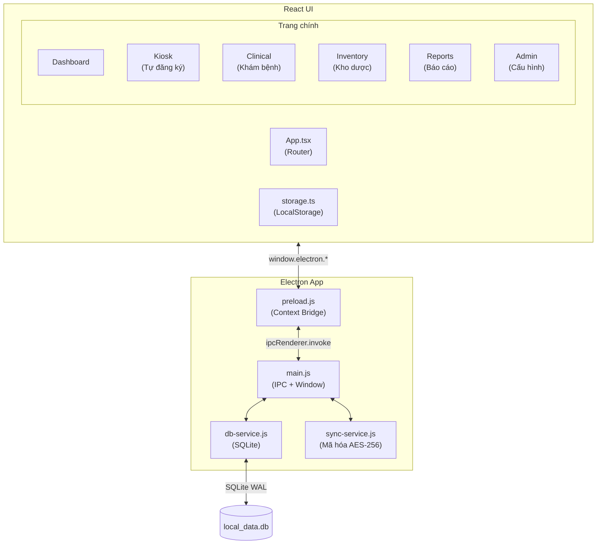
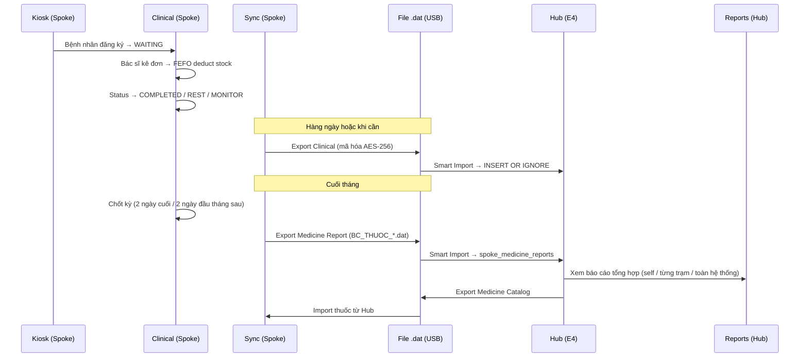
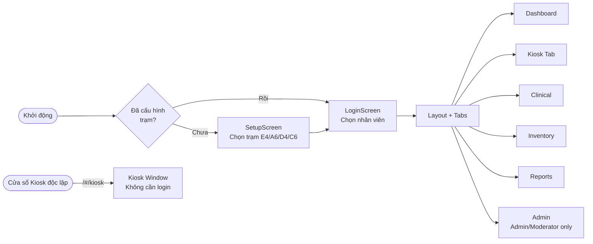

# GoertekVinaCare Smart Medical — Tổng quan hệ thống

> Cập nhật: 2026-04-17 | Phiên bản: 1.26.04.17

---

## 1. Kiến trúc tổng thể



---

## 2. Luồng dữ liệu Spoke ↔ Hub



---

## 3. Sơ đồ màn hình & phân quyền



---

## 4. Database Schema

| Bảng | Mục đích | Trường chính |
|------|----------|--------------|
| `encounters` | Ca khám bệnh | id, patient_id, status, prescriptions(JSON), is_synced, is_supplementary |
| `medicines` | Kho thuốc & vật tư | id, name, stock, batch_number, expiry_date, station |
| `inventory_logs` | Lịch sử xuất/nhập kho | type, source, target, items(JSON), timestamp |
| `clinical_events` | Audit trail | encounter_id, action_type, actor_name, details |
| `health_checkups` | KSK hàng năm | employee_id, year, health_class, disease_conclusion |
| `period_close_records` | Chốt kỳ tháng | station, period_year, period_ref, snapshot(JSON) |
| `spoke_medicine_reports` | Báo cáo thuốc Spoke→Hub | station, period_month, period_year, data(JSON), file_id(UNIQUE) |
| `import_history` | Chống import trùng | fileId(PK), fileName, importType, sourceStation |

---

## 5. Feature Map — Trạng thái hiện tại

### Module: Khám bệnh (Clinical)
| Tính năng | Trạng thái | Ghi chú |
|-----------|-----------|---------|
| Kiosk tự đăng ký (quẹt thẻ) | ✅ Hoàn chỉnh | Cửa sổ độc lập |
| Danh sách bệnh nhân chờ | ✅ Hoàn chỉnh | Real-time update |
| Kê đơn + trừ kho FEFO | ✅ Hoàn chỉnh | |
| Chẩn đoán & nhóm bệnh | ✅ Hoàn chỉnh | |
| Y lệnh / hướng dẫn thêm | ✅ Hoàn chỉnh | |
| Timeline bệnh nhân | ✅ Hoàn chỉnh | Encounters + KSK |
| Notification bell | ✅ Hoàn chỉnh | Chờ >60p, nghỉ >30p, chốt kỳ |
| Xóa / sửa ca khám | ✅ Có (Admin) | |
| Đơn bổ sung cuối kỳ | ✅ Hoàn chỉnh | |

### Module: Kho dược (Inventory)
| Tính năng | Trạng thái | Ghi chú |
|-----------|-----------|---------|
| Nhập kho từ nhà cung cấp | ✅ Hoàn chỉnh | |
| Nhập kho từ Hub (file .dat) | ✅ Hoàn chỉnh | |
| Chuyển kho giữa trạm | ✅ Hoàn chỉnh | |
| Xuất hủy | ✅ Hoàn chỉnh | |
| Lịch sử xuất nhập (log) | ✅ Hoàn chỉnh | |
| Dự báo hết hàng | ✅ Có | Analytics tab |
| Chốt kỳ tháng | ✅ Hoàn chỉnh | 2 ngày cuối/đầu tháng |
| Gửi báo cáo thuốc về Hub | ✅ Hoàn chỉnh | Sau khi chốt kỳ |
| Nhập kho bằng file (chỉ 1 lần) | ⚠️ Thiếu | Cần cơ chế import từ file có dedup |

### Module: Đồng bộ (Sync)
| Tính năng | Trạng thái | Ghi chú |
|-----------|-----------|---------|
| Export ca khám (Spoke→Hub) | ✅ Hoàn chỉnh | Toàn bộ ca, kể cả đơn bổ sung |
| Smart Import (Hub) | ✅ Hoàn chỉnh | Auto-detect CLINICAL / MEDICINE_REPORT |
| Export danh mục thuốc (Hub→Spoke) | ✅ Hoàn chỉnh | |
| Import danh mục thuốc (Spoke) | ✅ Hoàn chỉnh | |
| Chống import trùng (fileId) | ✅ Hoàn chỉnh | import_history table |
| Dedup encounter (INSERT OR IGNORE) | ✅ Hoàn chỉnh | |
| Notification thiếu báo cáo Spoke | ✅ Hoàn chỉnh | Hub, ngày 1-5 hàng tháng |

### Module: Báo cáo (Reports)
| Tính năng | Trạng thái | Ghi chú |
|-----------|-----------|---------|
| Thống kê ca khám theo ngày/tháng | ✅ Hoàn chỉnh | |
| Pie chart phân bố trạng thái | ✅ Hoàn chỉnh | |
| Export Excel ca khám | ✅ Hoàn chỉnh | ReportWizard |
| Báo cáo sử dụng thuốc (Hub) | ✅ Hoàn chỉnh | Self / Từng trạm / Tổng hệ thống |
| KSK hàng năm: import CSV | ✅ Hoàn chỉnh | |
| KSK hàng năm: báo cáo tổng hợp | ✅ Hoàn chỉnh | Theo giới tính, phân loại sức khỏe |
| Báo cáo nhóm bệnh | ✅ Có | Lọc được trong Reports |
| Báo cáo chi phí thuốc | ❌ Chưa có | Cần thêm giá vào Medicine |

### Module: Admin
| Tính năng | Trạng thái | Ghi chú |
|-----------|-----------|---------|
| Quản lý phác đồ điều trị | ✅ Hoàn chỉnh | |
| Quản lý danh mục triệu chứng | ✅ Hoàn chỉnh | |
| Quản lý danh mục nhóm bệnh | ✅ Hoàn chỉnh | |
| Cấu hình trạm | ✅ Hoàn chỉnh | |
| Cập nhật ứng dụng | ✅ Hoàn chỉnh | |
| Reset dữ liệu | ✅ Có (Admin only) | |
| Quản lý nhân viên | ⚠️ Hardcode | Danh sách trong constants.ts |

---

## 6. Luồng tháng (Lịch vận hành)

```
Hàng ngày:
  Spoke → Export ca khám → Hub Smart Import

Cuối tháng (ngày 28-31 hoặc ngày 1-2 tháng sau):
  Spoke → Chốt kỳ → Export BC Thuốc → Hub Smart Import
  
Ngày 1-5 tháng mới:
  Hub Notification Bell báo trạm nào chưa gửi báo cáo thuốc
  Hub xem báo cáo tổng hợp thuốc toàn hệ thống

Hàng năm:
  Admin import CSV kết quả KSK
  Xem báo cáo KSK theo năm/tháng
```

---

## 7. Backlog — Ý tưởng & việc cần làm

> Thêm ý tưởng mới vào đây trước khi triển khai. Ưu tiên xong mới làm.

### 🔴 Quan trọng / Cần thiết
- [ ] **Nhập kho bằng file (dedup)** — Spoke nhập hàng từ Hub qua file, cơ chế chỉ cho nhập 1 lần theo fileId (tương tự import_history)
- [ ] **Giá thuốc** — Thêm trường `price` vào Medicine để tính báo cáo chi phí

### 🟡 Nên có
- [ ] **Danh sách nhân viên dynamic** — Hiện hardcode trong constants.ts, nên đổi sang DB để Admin thêm/xóa/sửa
- [ ] **Mật khẩu đăng nhập** — Hiện chỉ chọn tên, không có xác thực
- [ ] **Backup database** — Nút backup/restore file .db ra USB
- [ ] **Báo cáo chi phí thuốc** — Dựa trên giá × số lượng sử dụng theo tháng

### 🟢 Nice-to-have
- [ ] **In phiếu kê đơn** — Print prescription slip ra máy in nhiệt
- [ ] **QR code check-in** — Thay vì quẹt thẻ từ
- [ ] **Dark mode**
- [ ] **Tìm kiếm bệnh nhân nhanh** — Trong Clinical tab khi danh sách dài

### ✅ Đã hoàn thành gần đây
- [x] Notification bell (chờ >60p, nghỉ >30p, chốt kỳ, thiếu BC)
- [x] Smart Import Hub (auto-detect file type)
- [x] Báo cáo thuốc Spoke→Hub (multi-scope: self/station/total)
- [x] Chốt kỳ chỉ cho phép 2 ngày cuối/đầu tháng
- [x] Dedup encounter dùng INSERT OR IGNORE ở Hub
- [x] Build không tạo portable .exe, chỉ win-unpacked

---

*File này để tra cứu và lên kế hoạch. Cập nhật mỗi khi có tính năng mới hoặc ý tưởng.*
